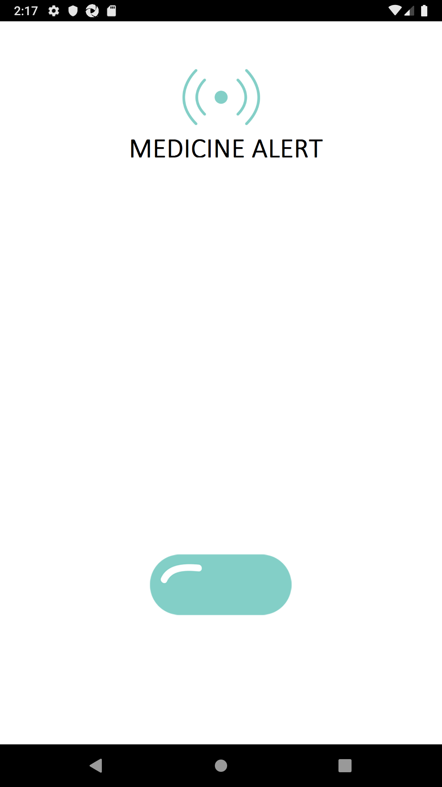
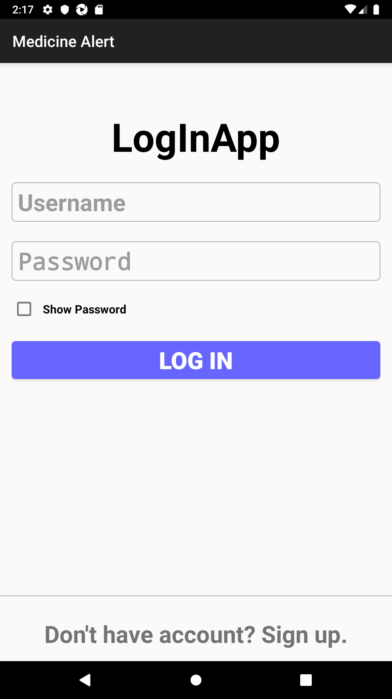
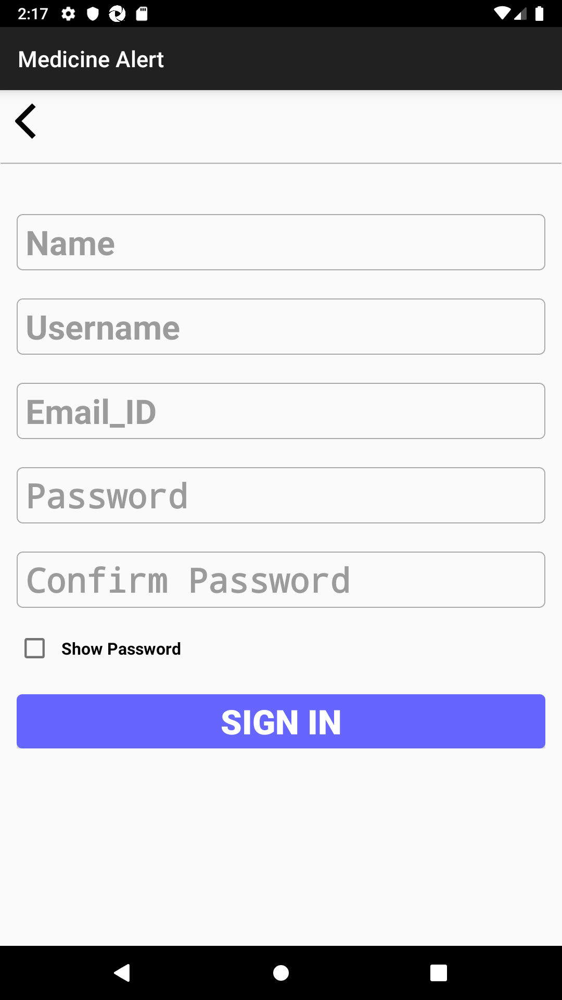
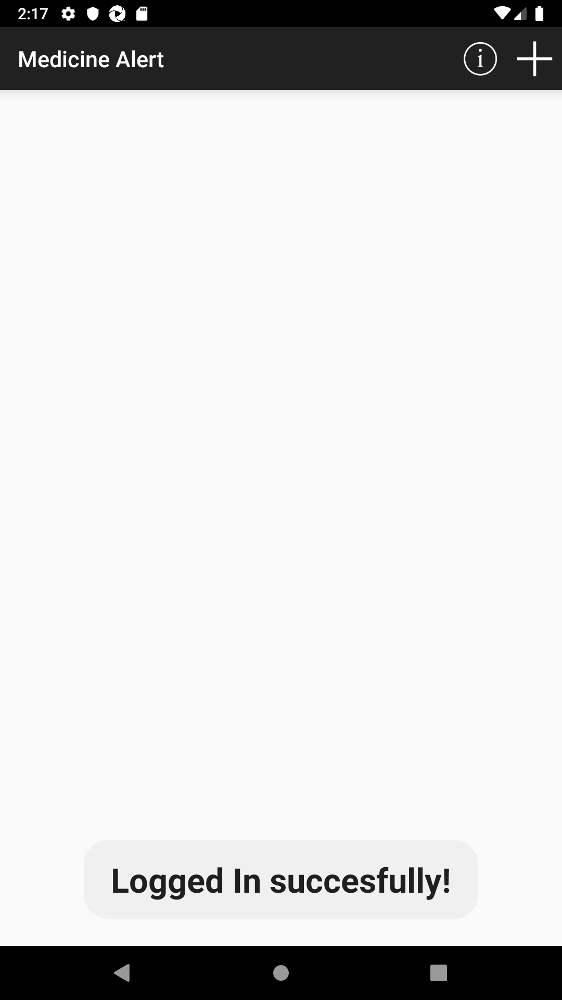
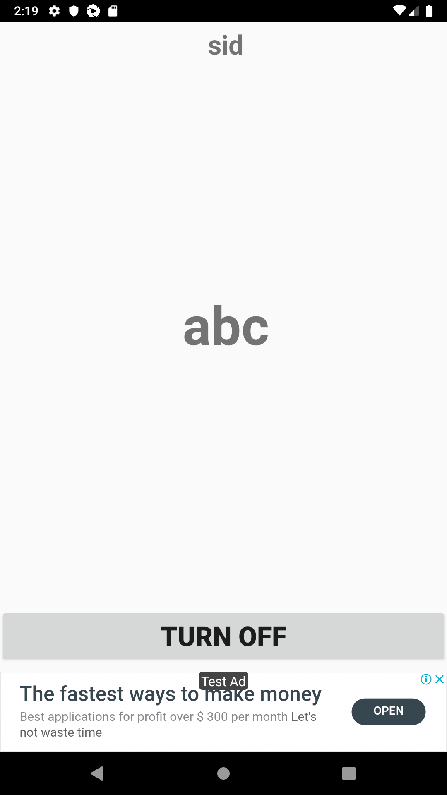

# Medicine_Alert_Application
This is an Medicine Alert Application, however this can help to remember medicine times by setting the alert, so that one can get notified to get the medicines on time

# Screenshots

